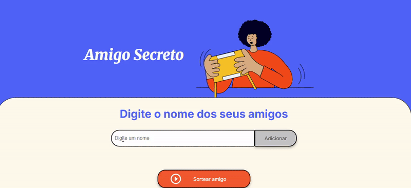
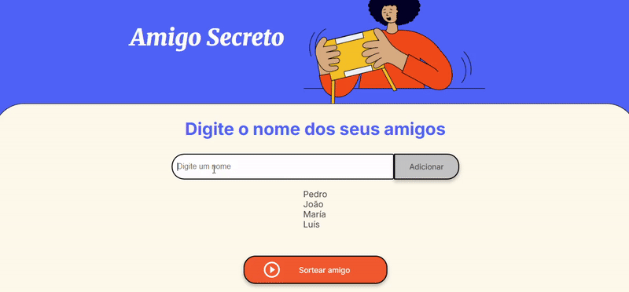
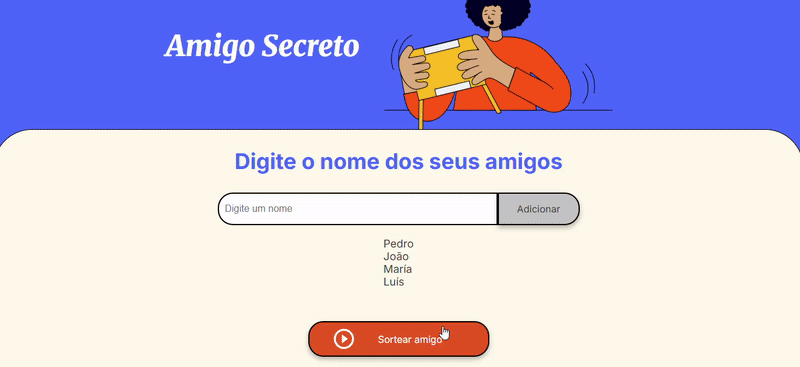

# 🎁 Sorteador de Amigo Secreto

Status do Projeto: ✔️ Concluído

## 📚 Tópicos

🔹 [Descrição do projeto](#descrição-do-projeto)  
🔹 [Funcionalidades](#funcionalidades)  
🔹 [Layout da Aplicação](#layout-da-aplicação-)  
🔹 [Pré-requisitos](#pré-requisitos)  
🔹 [Como rodar a aplicação](#como-rodar-a-aplicação-️)  
🔹 [Casos de Uso](#casos-de-uso)  
🔹 [Linguagens e tecnologias utilizadas](#linguagens-e-tecnologias-utilizadas-)  
🔹 [Desenvolvedores](#desenvolvedorescontribuintes)

## Descrição do projeto

O **Sorteador de Amigo Secreto** é uma aplicação web simples e interativa que permite organizar sorteios de amigo secreto de forma digital. O projeto foi desenvolvido como parte de um desafio de lógica de programação, focando em manipulação do DOM, arrays e interatividade com o usuário.

A aplicação oferece uma interface intuitiva onde os usuários podem adicionar nomes de participantes, visualizar a lista em tempo real e realizar o sorteio com apenas um clique, incluindo funcionalidades extras como síntese de voz e atalhos de teclado.

## Funcionalidades

✔️ **Adicionar participantes**: Inserção de nomes através de input de texto  
✔️ **Validação de entrada**: Impede adicionar nomes vazios  
✔️ **Lista dinâmica**: Visualização em tempo real dos participantes adicionados  
✔️ **Sorteio aleatório**: Seleção randômica de um participante da lista  
✔️ **Atalho de teclado (adicional)**: Adicionar participantes pressionando Enter  
✔️ **Síntese de voz (adicional)**: Leitura do resultado do sorteio em português brasileiro  
✔️ **Múltiplos sorteios (adicional)**: Possibilidade de realizar vários sorteios com a mesma lista

## Layout da Aplicação 💨

_capturas de tela da aplicação ou gifs aqui_

```






```

## Pré-requisitos

✅ **Navegador web moderno** (Chrome, Firefox, Safari, Edge)  
✅ **Suporte à Web Speech API** (opcional - para funcionalidade de voz)

Não são necessárias instalações adicionais, pois é uma aplicação client-side pura.

## Como rodar a aplicação ▶️

1. **Clone o repositório**:

```bash
git clone https://github.com/[seu-usuario]/sorteador-amigo-secreto
```

2. **Navegue até o diretório do projeto**:

```bash
cd sorteador-amigo-secreto
```

3. **Abra o arquivo HTML**:
   - Opção 1: Abra o `index.html` diretamente no navegador
   - Opção 2: Use um servidor local (recomendado):

```bash
# Com Python 3
python -m http.server 8000

# Com Node.js (http-server)
npx http-server

# Com PHP
php -S localhost:8000
```

4. **Acesse no navegador**:

```
http://localhost:8000
```

## Casos de Uso

### 📝 **Sorteio Básico**

1. Digite o nome do primeiro participante
2. Clique em "Adicionar" ou pressione Enter
3. Repita para todos os participantes
4. Clique em "Sortear amigo" para revelar o resultado

### 🎯 **Casos Especiais**

- **Resorteio**: Se necessário sortear novamente (ex: pessoa sorteou a si mesma), basta clicar novamente em "Sortear amigo"
- **Lista pequena**: A aplicação funciona com ao menos 2 participantes
- **Acessibilidade**: O resultado é falado em voz alta automaticamente (se suportado pelo navegador)

### 🎪 **Exemplo de Uso Corporativo**

Para um amigo secreto da empresa:

- Adicione todos os colaboradores
- Realize o sorteio em reunião
- O áudio garante transparência do resultado
- Permite resorteio caso necessário (ex: pessoa de férias)

## Linguagens e tecnologias utilizadas 📚

- **HTML5** - Estrutura da aplicação
- **CSS3** - Estilização e layout responsivo
- **JavaScript (ES6+)** - Lógica da aplicação e interatividade
- **Web Speech API** - Síntese de voz
- **DOM API** - Manipulação de elementos HTML

## Desenvolvedores/Contribuintes

| [<br><sub>[Martín Pérez Tovar]</sub>](https://github.com/martinpereztovar) |
| :----------------------------------------------------------------------------------------------------------------------: |

## Licença

The MIT License (MIT)

Copyright ©️ 2025 - Sorteador de Amigo Secreto
